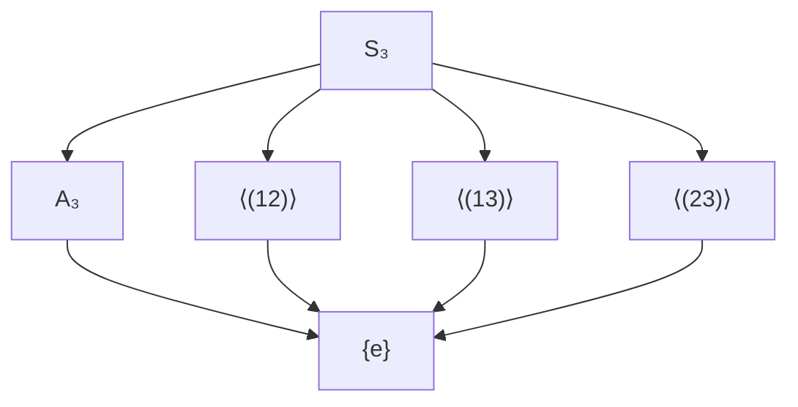

# Content Authoring Guide

Available features for markdown posts and TOML data files.

## Markdown Posts

Posts live in `content/posts/` as `.md` files. Subdirectories create nested slugs
(e.g. `content/posts/cs/sorting-algorithms.md` → `/blog/cs/sorting-algorithms`).

### Frontmatter

Every post starts with YAML-style frontmatter between `---` markers.
Fields should follow this standard order:

```
---
title: My Post Title
description: A brief summary shown in the post list
series: My Series Name
series_order: 1
tags: rust, wasm, leptos
publication: cs
project: lsck0.github.io
sources: https://example.com/ref1, https://example.com/ref2
draft: true
toc: true
---
```

#### Required fields

| Field   | Description               |
| ------- | ------------------------- |
| `title` | Display title of the post |

#### Automatic fields

Dates are derived from git history at build time — no manual `date` field needed.

| Field         | Source                        | Description                                       |
| ------------- | ----------------------------- | ------------------------------------------------- |
| `created`     | First git commit of the file  | Creation date, shown as the post date             |
| `last_edited` | Latest git commit of the file | Last edit date, shown when different from created |

#### Optional fields

| Field          | Description                                                |
| -------------- | ---------------------------------------------------------- |
| `description`  | Short summary shown under the title in the blog listing    |
| `series`       | Name of a series — posts with the same name are grouped    |
| `series_order` | Integer ordering within the series (ascending)             |
| `tags`         | Comma-separated tags, used for filtering on `/blog`        |
| `project`      | Links this post to a project entry                         |
| `publication`  | Links this post to a publication entry                     |
| `sources`      | Comma-separated URLs for references not linked in the body |
| `draft`        | Set to `true` to show only in dev mode with DRAFT banner   |
| `toc`          | Set to `true` to enable section numbering + collapsible TOC |

### Content features

#### Code blocks

Fenced code blocks with a language tag get syntax highlighting via Prism.
A "copy code" button appears on hover (top-right).

````
```rust
fn main() { println!("hello"); }
```
````

#### Diff highlighting

Use `diff` as the language for code blocks. Lines starting with `+` get a green
background, lines starting with `-` get red:

````
```diff
+added line
-removed line
 unchanged line
```
````

#### Special code blocks

| Language  | Renders as                    | Copy button    |
| --------- | ----------------------------- | -------------- |
| `tikz`    | TikZ diagram via tikzjax      | "copy tex"     |
| `tikzcd`  | Commutative diagram (tikz-cd) | "copy tex"     |
| `mermaid` | Mermaid diagram               | "copy mermaid" |

All special blocks show a copy button on hover that copies the source.

#### Math

Inline math with `$...$` and display math with `$$...$$`. Rendered via KaTeX.
Display math blocks show a "copy tex" button on hover.

Math in headings (`# Heading with $\alpha$`) renders correctly as KaTeX in both
the heading and the table of contents.

#### Labeled blocks (definitions, theorems, etc.)

Use backtick-fenced blocks where the "language" is a block kind:

````
```definition Group {#def-group}
A **group** is a set $G$ with a binary operation $\cdot$ satisfying...
```

```theorem Lagrange's Theorem {#thm-lagrange}
For any finite group $G$ and subgroup $H$...
```

```proof
By counting cosets...
```
````

Supported numbered kinds: `definition`, `theorem`, `lemma`, `corollary`,
`proposition`, `example`, `axiom`, `remark`, `conjecture`, `exercise`, `problem`,
`figure`.

Unnumbered: `proof` (with QED symbol).

Callouts: `tip`, `warning`, `danger`, `note`, `info`.

All numbered blocks share a single counter per post. Labels are optional but
enable cross-referencing.

##### Definition aliases

Definitions can have aliases that also auto-link in prose:

````
```definition Characteristic | char {#def:characteristic}
The characteristic of a field is...
```
````

Both "characteristic" and "char" will auto-link to this definition.

##### Nesting

Use more backticks for the outer block to nest blocks:

`````
````theorem Fundamental Theorem {#fund-thm}
Statement.

```proof
Proof here.
```
````
`````

#### Referencing and citations

There are several distinct mechanisms for referencing other content. Each serves
a different purpose and renders differently.

##### Quick comparison

| Syntax | What it references | Renders as | Hover preview |
| --- | --- | --- | --- |
| `[[def:group]]` | Labeled block (same post) | "Definition 1" | Block content with math |
| `[[thm:lagrange\|Lagrange]]` | Labeled block (custom text) | "Lagrange" | Block content with math |
| `[[math/group-theory#def:group]]` | Labeled block (other post) | "Definition 1" | Block content with math |
| `[[eq:first-iso]]` | Numbered equation | "(1)" | Equation content |
| `[[fig:phase-diagram]]` | Numbered figure | "Figure 1" | Figure content |
| `[@lang_algebra]` | BibTeX entry | "[1]" | None (scrolls to bibliography) |
| `[@key1; @key2]` | Multiple BibTeX entries | "[1, 2]" | None |
| `[^1]` | Footnote | Superscript "1" | None (sidenote on desktop) |
| `[text](/blog/slug)` | Another post | "text" | Post title, description, tags |
| `[text](https://...)` | External URL | "text" | Favicon, domain, OG metadata |
| `![[slug]]` | Another post (embed) | Full post body inline | N/A |

##### Cross-references (`[[label]]`)

Reference any labeled block — definitions, theorems, equations, figures — by its
label. The display text is generated automatically from the block kind and number.

````
```definition Group {#def:group}
A **group** $(G, \cdot)$ is a set $G$ together with a binary operation...
```

```theorem Lagrange's Theorem {#thm:lagrange}
If $G$ is a finite group and $H \leq G$, then $|H|$ divides $|G|$.
```

By [[def:group]], a group must satisfy three axioms.
This follows from [[thm:lagrange]].
````

**Renders as:** "By Definition 1, a group must satisfy three axioms. This follows
from Theorem 2."

Each reference becomes a link that scrolls to the block. Hovering shows a tooltip
with the full block content (math rendered via KaTeX).

**Custom display text:** Override the auto-generated text with a pipe:

```
See [[def:group|the definition of a group]] for details.
```

**Cross-post references:** Prefix with the slug to reference blocks in other posts:

```
As shown in [[math/group-theory#def:group]], ...
```

**Auto-generated display text by kind:**

| Block kind | Display text |
| --- | --- |
| `definition`, `theorem`, `lemma`, ... | "Definition 1", "Theorem 2", etc. |
| `equation` | "(1)" |
| `figure` | "Figure 1" |
| `proof` | "Proof" |

##### Auto-linking

Definition titles automatically become links when they appear in prose text
within the same post. No special syntax required.

````
```definition Subgroup {#def:subgroup}
A subset $H \subseteq G$ is a **subgroup** of $G$ if...
```

Every group has at least two subgroups: the trivial subgroup and $G$ itself.
````

The word "subgroups" in the prose automatically links to `#def:subgroup` with a
hover preview, even without writing `[[def:subgroup]]`.

**Aliases:** Definitions can declare multiple names that all auto-link:

````
```definition Characteristic | char {#def:characteristic}
The characteristic of a field is the smallest positive $n$ with $n \cdot 1 = 0$,
or $0$ if no such $n$ exists.
```

A field of char $0$ is always infinite. The characteristic determines...
````

Both "characteristic" and "char" auto-link to the same definition.

##### Numbered equations

Label display math with `{#eq:label}` to assign a number and register it for
cross-referencing. The label goes on the line immediately after the closing `$$`:

```
$$G / \ker(\varphi) \cong \text{im}(\varphi)$$
{#eq:first-iso}
```

**Renders as:** The equation with an auto-injected `\tag{1}` on the right.

Reference it anywhere with `[[eq:first-iso]]`, which renders as "(1)".

The label can also be on the same line as a single-line equation:

```
$$E = mc^2$$ {#eq:mass-energy}
```

Equations are numbered independently from other labeled blocks (their own counter).

##### Numbered figures

Figures use the `figure` labeled block and get their own independent counter:

````
```figure Cayley graph of $S_3$ {#fig:cayley-s3}

```
````

**Renders as:** An HTML `<figure>` with a `<figcaption>` reading "Figure 1.
Cayley graph of S_3". The content (image, diagram, etc.) appears centered above
the caption.

Reference with `[[fig:cayley-s3]]`, which renders as "Figure 1".

Figures can contain any content — images, TikZ/Mermaid diagrams, tables:

````
```figure Subgroup lattice of $S_3$ {#fig:lattice}

```
````

##### BibTeX citations (`[@key]`)

Cite entries from the global bibliography file `content/references.bib`. This is
for referencing published works (books, papers, articles), not for internal
cross-references.

```
The foundational treatment follows Lang [@lang_algebra].
```

**Renders as:** "The foundational treatment follows Lang [1]." where [1] is a
link that scrolls to the bibliography section at the bottom of the post.

**Multiple citations** in a single bracket:

```
See [@lang_algebra; @dummit_foote; @aluffi] for comprehensive treatments.
```

**Renders as:** "See [1, 2, 3] for comprehensive treatments."

**Bibliography section:** A numbered bibliography is automatically appended to
any post that uses citations. Entries are formatted as:

> 1. S. Lang. *Algebra*. Springer, 2002.
> 2. D. S. Dummit, R. M. Foote. *Abstract Algebra*. John Wiley & Sons, 2004.

Only cited entries appear — the full `.bib` file can contain many entries without
bloating individual posts.

**Unknown keys** render as `[?key]` with a `cite-broken` CSS class to make them
visually obvious.

The `.bib` file uses standard BibTeX format:

```bibtex
@book{lang_algebra,
    author = {Lang, Serge},
    title = {Algebra},
    edition = {3rd},
    publisher = {Springer},
    year = {2002},
}
```

Supported entry types: `@book`, `@article`, `@misc`, `@inproceedings`. Comments
start with `//`.

##### Footnotes

Side notes for tangential commentary. Not for citations — use BibTeX for that.

```
The symmetric group $S_n$ plays a central role in algebra.[^1]

[^1]: Cayley's theorem states that every finite group embeds into some $S_n$.
```

On wide screens (>=1201px), footnotes float into the right margin as sidenotes
next to the paragraph that references them. On mobile, they are collected into a
"Footnotes" section before the bibliography and references.

##### Links to other posts

Standard markdown links to `/blog/{slug}` create navigable internal links with
hover previews and automatic back-reference tracking:

```
See [the post on lambda calculus](/blog/cs/lambda-calculus) for background.
```

**Hover preview:** Shows the post's title, description, tags, and series info.

**Back-references:** The linked post's reference section will show this post
under "Referenced internally by" with backlink markers (^1, ^2, ...) that scroll
to where the link appears.

##### External links

Standard markdown links to URLs. Hover previews show the favicon, domain, URL
path, and pre-fetched OG metadata (title, description, image) when available:

```
See the [nLab article on groups](https://ncatlab.org/nlab/show/group).
```

External links in post content open in a new tab. URLs are also collected in the
post's "External references" section with backlink markers.

##### Sources (frontmatter)

URLs in the `sources` frontmatter field appear in a dedicated "Sources" section
on the post page. Use this for references that aren't cited inline:

```yaml
sources: https://en.wikipedia.org/wiki/Group_(mathematics), https://ncatlab.org/nlab/show/group
```

These are separate from BibTeX citations — use `sources` for web references you
want to list without inline `[@key]` citations.

##### Transclusion

Embed the full body of another post inline at build time:

```
![[cs/lambda-calculus]]
```

The referenced post's entire rendered body replaces this line. Useful for
including prerequisite material or shared definitions without duplicating content.

##### When to use what

| Situation | Use |
| --- | --- |
| Refer to a definition/theorem in the same post | `[[label]]` or auto-linking |
| Refer to a definition/theorem in another post | `[[slug#label]]` |
| Refer to a numbered equation | `[[eq:label]]` |
| Refer to a numbered figure | `[[fig:label]]` |
| Cite a published book/paper | `[@bib_key]` |
| Add a tangential remark | `[^N]` footnote |
| Link to another post for context | `[text](/blog/slug)` |
| Link to an external resource inline | `[text](https://...)` |
| List reference URLs without inline citation | `sources:` frontmatter |
| Include another post's content verbatim | `![[slug]]` |

#### Callouts / Admonitions

Use backtick-fenced blocks with a callout kind, or blockquote syntax:

````
```tip
This is a tip callout.
```

```warning
This is a warning.
```
````

Or blockquote syntax:

```
> [!tip]
> This is a tip callout.
```

Supported types: `tip` (green), `warning` (red), `danger` (red),
`note` (accent), `info` (blue).

#### Link hover previews

All links in posts and listing pages show a tooltip on hover that persists while
the cursor is on the link or the tooltip itself. Tooltips support nested hovering:
definitions within a hover can themselves be hovered to show stacked tooltips
(up to 4 levels deep).

| Link type | Preview content |
| --- | --- |
| Cross-references (`[[label]]`) | Full block content with rendered KaTeX math |
| Internal post links (`/blog/slug`) | Title, description, tags, series info |
| External links (`https://...`) | Favicon, domain, URL path, OG metadata (title, description, image) |
| Site links (`/about`, `/projects`) | Link text and path |
| Related posts (in projects/publications) | Post title, description, tags, series |

#### Series navigation

Posts with the same `series` frontmatter value get a collapsible series nav box
with a table of contents and prev/next links, ordered by `series_order`.

The blog listing shows a series badge (e.g. "[Series Name 2/4]") next to each post.

#### Searchable content (Ctrl+F)

Rendered KaTeX math, Mermaid diagrams, and TikZ diagrams include hidden text
copies of their source code, making them findable via browser Ctrl+F search.

### Blog listing features

- **Fuzzy search** — subsequence matching via nucleo-matcher (title 3× weight)
- **Tag filtering** — click to cycle: neutral → include → exclude
- **Bookmarks filter** — show only bookmarked posts
- **Read/unread** — posts are marked "read" via localStorage when visited; badge is clickable to toggle
- **Series badge** — shows "[Series Name X/Y]" for series posts
- **Pagination** — 10 posts per page
- **View modes** — list, tree (folder structure), series (grouped by series with progress, collapsible standalone section), bookmarks, graph (force-directed knowledge graph)
- **Post count** — shows filtered/total count when filters are active

### Post page features

- **Bookmark button** — SVG bookmark icon before the title
- **Reading progress bar** — thin accent bar at viewport top
- **In-post search** — Ctrl+F to search within the post content, with match highlighting and prev/next navigation
- **Table of contents** — collapsible, auto-generated from h1/h2/h3 headings (opt-in via `toc: true`). When enabled, headings get section numbers (1, 1.1, 2, etc.) and labeled blocks get section-scoped numbers (Definition 1.1 instead of Definition 1). When disabled, labeled blocks use a global counter (1, 2, 3, ...)
- **Draft banner** — yellow "DRAFT" banner for draft posts (dev mode only)
- **Scroll-to-top** — appears after scrolling past 50% viewport height
- **Giscus comments** — powered by GitHub Discussions
- **Read tracking** — marks post as read in localStorage
- **Pin button** — hover over any labeled block (definition, theorem, etc.)
  to reveal a "pin" button that saves it to the pinned sidebar panel
- **Pinned panel** — fixed right sidebar showing pinned blocks with rendered
  math, cross-reference tooltips, and source links. Items in the panel are
  hoverable for nested definition previews. When open on wide screens, main
  content reflows left to avoid overlap (sidenote footnotes become inline).
- **Study mode** — "study" button in pinned panel header opens an Anki-style
  flashcard modal: shows the block kind/title as the front, click "reveal" to
  show the content, then rate with three buttons: "didn't know" (re-inserts
  card 2× near front of deck), "unsure" (re-inserts in middle), or "knew it"
  (pushes to back; second consecutive "knew it" removes the card). Session ends
  when the deck is empty. Scores persist across sessions via localStorage
- **Mobile pins** — on small screens, a floating button shows the pin count;
  tapping it opens the pinned panel as a fullscreen overlay

## Site Metadata (`content/meta.toml`)

Site-wide metadata for SEO and page titles:

```toml
[site]
title = "/dev/lsck0"
description = "computer science, mathematics, and software engineering"
author = "Luca Sandrock"
url = "https://lsck0.github.io"
image = "https://lsck0.github.io/og-image.png"

[pages.home]
title = "/dev/lsck0"
description = "Personal knowledge base."

[pages.blog]
title = "blog"
description = "Posts on CS, math, and engineering."
```

### Fields

| Field         | Type   | Description                              |
| ------------- | ------ | ---------------------------------------- |
| `title`       | string | Site title                              |
| `description` | string | Site description for meta tags           |
| `author`      | string | Author name                             |
| `url`         | string | Site URL (used for OG URLs)              |
| `image`       | string | Default OG image URL (optional)          |

Each page section provides a title and description used for `<title>` tags
and meta descriptions.

## Build Pipeline

The Makefile.toml defines three tasks:

| Task       | Command                                            | Description                                  |
| ---------- | -------------------------------------------------- | -------------------------------------------- |
| `dev`      | `trunk serve --port 3000 --open`                   | Development server with HMR                  |
| `build`    | `trunk build --release` + wasm-opt + indexer + 404 | Production build (single source of truth)    |
| `ci`       | clippy + fmt check + `makers build`                | CI validation                                |
| `wasm-opt` | wasm-opt with bulk-memory flags                    | Manual WASM optimization (called by `build`) |

## Build-time Indexer

Running `cargo run --package indexer` after `trunk build` generates:

| File                          | Description                                  |
| ----------------------------- | -------------------------------------------- |
| `dist/graph.json`             | Node/edge graph of posts and their relations |
| `dist/search_index.json`      | Search index with slug, title, tags, desc    |
| `dist/rss.xml`                | RSS 2.0 feed                                 |
| `dist/atom.xml`               | Atom feed                                    |
| `dist/sitemap.xml`            | Sitemap for search engines                   |
| `dist/llms.txt`               | AI scraping opt-out file                     |
| `dist/og_external.json`       | Cached OG metadata for external links        |
| `dist/blog/{slug}/index.html` | Per-post HTML with OG meta tags for embeds   |
| `dist/{route}/index.html`     | Static route fallbacks for SPA direct nav    |

The OG pages are copies of `index.html` with site metadata from `meta.toml` replaced
and `<meta property="og:*">`, `<meta name="twitter:*">` tags injected, so social
platform crawlers see correct metadata even though the site is client-side rendered.
Each post gets its own OG image (defaults to `/og-image.png` in the site root).

## Client State

Bookmark and read state is managed via localStorage through a centralized
`components/storage` module. All pages use the same module — no duplicated
localStorage access patterns.

| Key pattern       | Value                | Description                              |
| ----------------- | -------------------- | ---------------------------------------- |
| `bookmark:{slug}` | `"1"`                | Post is bookmarked                       |
| `read:{slug}`     | timestamp            | Post has been viewed                     |
| `theme`           | `"dark"` / `"light"` | Current theme                            |
| `pinned-blocks`   | JSON array           | Pinned labeled blocks with preview HTML  |
| `study-scores`    | JSON object          | Per-block right/unsure/wrong counts      |

## Content Pipeline Architecture

The content pipeline has three layers:

1. **`crates/ir/`** — Core library: IR types, frontmatter parsing, markdown→IR
   parser, BibTeX parser, and cross-reference/citation resolution. Shared by the
   proc macro, frontend renderer, and indexer. Heading and block numbering is
   computed here (single source of truth for all numbering).

2. **`src/components/render.rs`** — IR→HTML renderer inlined in the frontend.
   Converts the IR block/inline tree into HTML strings with data attributes for
   JS post-processing (tooltips, pin buttons, math rendering). The renderer only
   displays what the IR tells it — no re-computation of numbering or structure.

3. **`crates/macros/`** — Proc macro crate that reads content at compile time,
   parses markdown into an IR tree, resolves cross-references and citations, and
   serializes the result as a `postcard`-encoded byte blob embedded in the WASM
   binary. At runtime, the frontend deserializes once via `LazyLock<SiteData>`.

4. **`crates/indexer/`** — Post-build binary that generates feeds, search index,
   graph data, OG pages, and sitemap from the same content source.

5. **`crates/lsp/`** — LSP server for content editing (see below).

## Projects (`content/projects.toml`)

```toml
[[projects]]
title = "my-project"
description = "What it does."
url = "https://github.com/..."
status = "maintained"
```

### Fields

| Field         | Type                | Description                                         |
| ------------- | ------------------- | --------------------------------------------------- |
| `title`       | string or segment[] | Project name                                        |
| `description` | string or segment[] | Short description                                   |
| `url`         | string (optional)   | Link (omit for no link)                             |
| `status`      | string              | One of: `maintained`, `wip`, `planned`, `abandoned` |
| `company`     | string (optional)   | Company name — marks project as professional        |
| `anonymous`   | bool (optional)     | If true, shown as professional without company name |

### Text segments

Fields like `title` and `description` support a scramble effect for teasers:

```toml
title = ["type-", { scrambled = 8 }]
description = [{ scrambled = 50 }]
```

- Plain string: rendered as-is
- Array of strings/tables: mixed plain + scrambled text
- `{ scrambled = N }`: renders N characters of randomly cycling text

## Publications (`content/publications.toml`)

```toml
[[publications]]
title = "Paper Title"
description = "Venue, year, and summary."
url = "https://arxiv.org/..."
authors = "A. Author, B. Author"
date = "2026"
```

### Fields

| Field         | Type                | Description                    |
| ------------- | ------------------- | ------------------------------ |
| `title`       | string or segment[] | Publication title              |
| `description` | string or segment[] | Venue/summary (supports LaTeX) |
| `url`         | string              | Link to the paper              |
| `authors`     | string or segment[] | Author list                    |
| `date`        | string or segment[] | Publication year               |

All text fields support the same segment array syntax as projects.

## Print / PDF Export

`Ctrl+P` or the print button triggers LaTeX-like print styles:

- Serif font (Computer Modern / Times), 10pt base, justified text
- Centered title block, text-indent for body paragraphs
- Italicized theorem content, upright proof content (traditional math typesetting)
- A4 page margins (2cm horizontal, 2.5cm vertical)
- TikZ diagrams forced visible (no dark-mode invert filter)
- Mermaid diagrams re-rendered in light theme before print
- Copy buttons, hover underlines, and navigation hidden
- KaTeX math forced to black text
- External links show URLs after link text

## OpenSearch

The site provides an OpenSearch description at `/opensearch.xml`, enabling browsers
to add the blog's search as a search engine. The search URL points to `/blog?q={searchTerms}`.

## Content LSP

A language server at `crates/lsp/` provides IDE features for markdown content
editing. It indexes all post labels, BibTeX entries, and post slugs from the
`content/` directory and provides real-time feedback while authoring.

### Features

| Feature | Trigger | Description |
| --- | --- | --- |
| Autocomplete | `[[` | Suggests all labels (definitions, theorems, etc.) and post slugs |
| Autocomplete | `[@` | Suggests BibTeX keys from `content/references.bib` |
| Go-to-definition | `[[label]]` | Jumps to the source file containing the labeled block |
| Diagnostics | On save | Warns about undefined `[[label]]` or `[@key]` references |
| Index rebuild | On save | Automatically re-indexes when any `.md` file is saved |

### How it works

1. On startup, the LSP scans `content/posts/` recursively for `.md` files
2. Each file is parsed to extract frontmatter (title, toc) and labeled blocks
3. `content/references.bib` is parsed for citation keys
4. A content index maps labels → (kind, title, slug) and keys → display labels
5. Completions, definitions, and diagnostics query this index
6. Saving any file triggers a full re-index

### Running the LSP

Build and run directly:

```bash
cargo run --package lsp
```

Or build a release binary for faster startup:

```bash
cargo build --release --package lsp
# binary at target/release/lsp
```

### Editor configuration

#### Neovim

Add to your Neovim config (e.g. `~/.config/nvim/lua/plugins/blog-lsp.lua` or
directly in `init.lua`). This attaches the LSP only to markdown files within
the blog project directory:

```lua
-- blog content LSP: autocomplete for [[cross-refs]] and [@citations]
local blog_root = vim.fn.expand("~/code/lsck0.github.io")
local lsp_cmd = { blog_root .. "/target/release/lsp" }

-- fall back to cargo run if no release binary
if vim.fn.executable(lsp_cmd[1]) == 0 then
  lsp_cmd = { "cargo", "run", "--package", "lsp" }
end

vim.api.nvim_create_autocmd("FileType", {
  pattern = "markdown",
  callback = function(args)
    -- only attach when editing files inside the blog project
    local file = vim.api.nvim_buf_get_name(args.buf)
    if not file:find(blog_root, 1, true) then return end

    vim.lsp.start({
      name = "blog-lsp",
      cmd = lsp_cmd,
      root_dir = blog_root,
      settings = {},
    })
  end,
})
```

If using `lazy.nvim`, wrap in a plugin spec:

```lua
return {
  dir = "~/code/lsck0.github.io",
  ft = "markdown",
  config = function()
    -- paste the autocmd block above here
  end,
}
```

#### VS Code

Use a generic LSP client extension (e.g. "vscode-languageclient") with this
`.vscode/settings.json`:

```json
{
  "languageServerExample.serverPath": "./target/release/lsp",
  "languageServerExample.fileTypes": ["markdown"]
}
```

Or point any LSP client extension to `cargo run --package lsp` as the server
command with the project root as the workspace directory.

## Anti-AI Measures

- `robots.txt` blocks known AI crawlers (ClaudeBot, GPTBot, etc.)
- `<meta name="robots" content="noai, noimageai">` in HTML head
- `/llms.txt` generated by the indexer
- TOS explicitly opts out of AI training (MIT license with AI carve-out)
