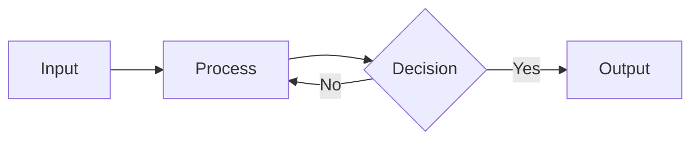

Welcome. This blog renders $\LaTeX$, TikZ diagrams, and Mermaid charts client-side.

## Mathematics

Euler's identity: $e^{i\pi} + 1 = 0$.

The Basel problem:

$$ \sum\_{n=1}^{\infty} \frac{1}{n^2} = \frac{\pi^2}{6} $$

## Code Blocks

```latex
\sum_{n=1}^{\infty} \frac{1}{n^2} = \frac{\pi^2}{6}
```

```rust
fn main() {
    let x = vec![1, 2, 3];
    let y: Vec<i32> = x.iter().map(|i| i * 2).collect();
    println!("{:?}", y);
}
```

## A TikZ Diagram

```tikz
\begin{tikzpicture}
  \draw[->] (-2,0) -- (2,0) node[right] {$x$};
  \draw[->] (0,-2) -- (0,2) node[above] {$y$};
  \draw[blue, thick, domain=-1.5:1.5, samples=100] plot (\x, {\x*\x});
\end{tikzpicture}
```

## A Commutative Diagram

```tikzcd
\begin{tikzcd}
  A \arrow[r, "f"] \arrow[d, "g"'] & B \arrow[d, "h"] \\
  C \arrow[r, "k"'] & D
\end{tikzcd}
```

## A Mermaid Diagram


