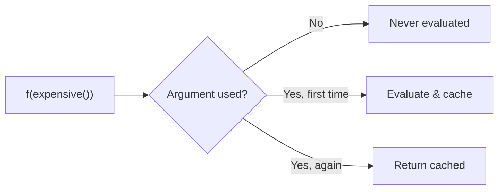

When a function is applied to an argument, *when* do we evaluate the argument? This choice has deep consequences.

## Call-by-Value

```definition Call-by-Value {#def:call-by-value}
Evaluate the argument **before** passing it in. The argument expression is reduced to a value, then substituted into the function body.
```

Most languages do this: C, Rust, Python, JavaScript.

```rust
fn square(x: i32) -> i32 { x * x }

// The argument (2 + 3) is evaluated to 5, then passed to square
square(2 + 3)  // square(5) -> 25
```

Simple and predictable. But it evaluates arguments even if they're never used.

## Call-by-Name

```definition Call-by-Name {#def:call-by-name}
Pass the argument **unevaluated**, substituting the expression directly into the function body. It is recomputed each time it's used.
```

This is what textbook [[cs/lambda-calculus#def:lambda-term]] calculus does.

If an argument is used twice, it's computed twice. If never used, it's never computed.

## Call-by-Need (Lazy)

```definition Call-by-Need {#def:call-by-need}
Like call-by-name, but **memoize** the result after first evaluation. The argument is evaluated at most once and only when needed.
```

Haskell uses this.



## Trade-offs

| Strategy       | Evaluates unused args? | Duplicates work? | Side effects predictable? |
|---------------|----------------------|-----------------|--------------------------|
| Call-by-value  | Yes                  | No              | Yes                      |
| Call-by-name   | No                   | Yes             | Tricky                   |
| Call-by-need   | No                   | No              | Tricky                   |

Strict (call-by-value) languages are easier to reason about with side effects. Lazy (call-by-need) languages compose better for pure computations.
