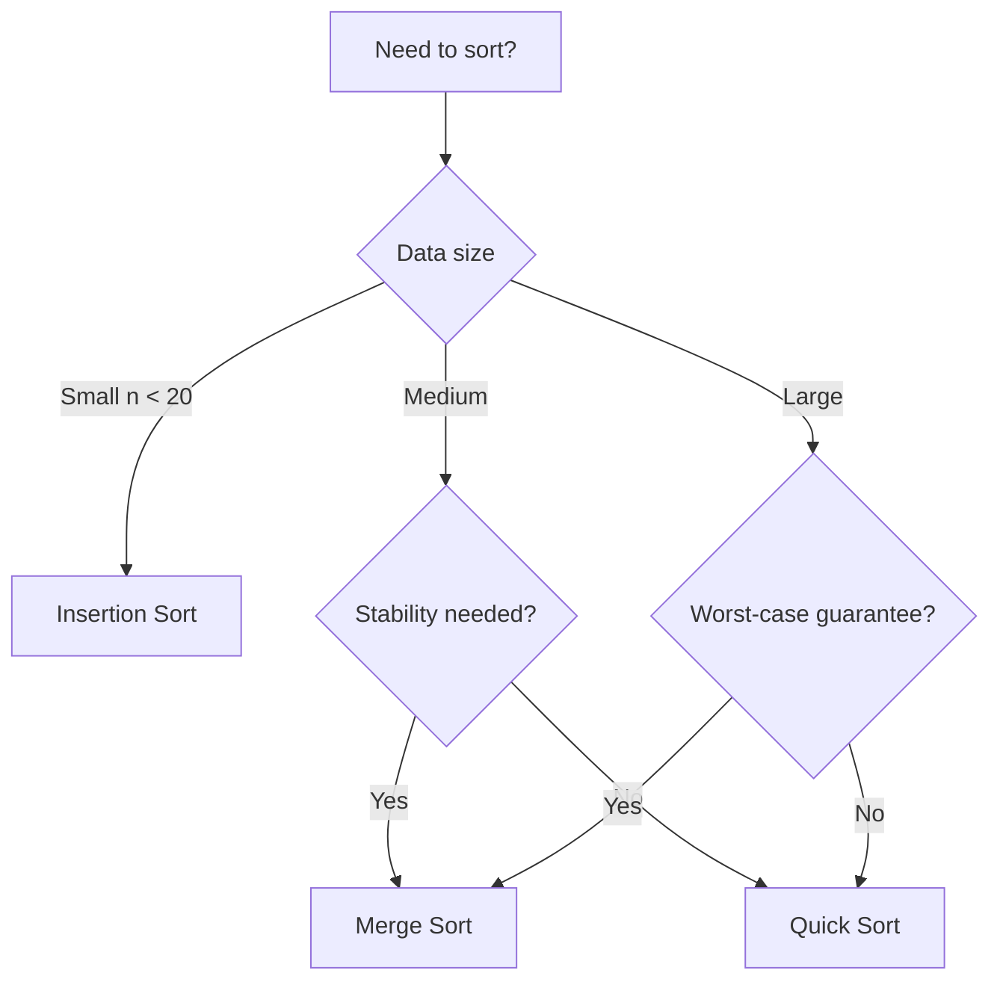

Sorting is one of the most fundamental operations in computer science. Let's compare a few classic algorithms.

## Complexity Overview

| Algorithm   | Best          | Average       | Worst         | Space       |
| ----------- | ------------- | ------------- | ------------- | ----------- |
| Bubble Sort | $O(n)$        | $O(n^2)$      | $O(n^2)$      | $O(1)$      |
| Merge Sort  | $O(n \log n)$ | $O(n \log n)$ | $O(n \log n)$ | $O(n)$      |
| Quick Sort  | $O(n \log n)$ | $O(n \log n)$ | $O(n^2)$      | $O(\log n)$ |

## Merge Sort in Rust

```rust
fn merge_sort(arr: &mut [i32]) {
    let len = arr.len();
    if len <= 1 {
        return;
    }
    let mid = len / 2;
    merge_sort(&mut arr[..mid]);
    merge_sort(&mut arr[mid..]);
    let mut merged = arr.to_vec();
    let (mut i, mut j, mut k) = (0, mid, 0);
    while i < mid && j < len {
        if arr[i] <= arr[j] {
            merged[k] = arr[i];
            i += 1;
        } else {
            merged[k] = arr[j];
            j += 1;
        }
        k += 1;
    }
    merged[k..].copy_from_slice(if i < mid { &arr[i..mid] } else { &arr[j..len] });
    arr.copy_from_slice(&merged);
}
```

## Decision Flow



The choice of sorting algorithm depends heavily on context: data size, whether stability matters, memory constraints, and whether the data is nearly sorted.
