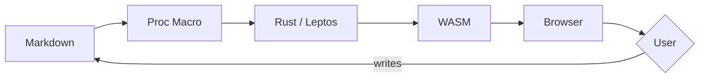
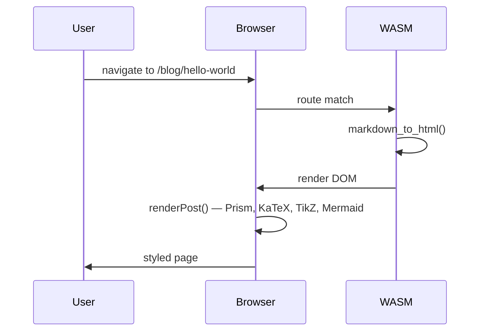

Welcome to the blog. This post is a living showcase of everything the markdown engine supports. If you're writing a post and can't remember the syntax for something, this is the reference.

## Inline formatting

Regular text, **bold**, _italic_, **_bold italic_**, ~~strikethrough~~, and `inline code`. Links look like [this](/about) and external links like [Rust](https://www.rust-lang.org/).

## Mathematics

Inline math: Euler's identity $e^{i\pi} + 1 = 0$ sits beautifully in a sentence. The gamma function $\Gamma(n) = (n-1)!$ for positive integers, or more generally:

$$\Gamma(z) = \int_0^{\infty} t^{z-1} e^{-t}\, dt$$

The Basel problem[^1]:

$$\sum_{n=1}^{\infty} \frac{1}{n^2} = \frac{\pi^2}{6}$$

A matrix equation:

$$\begin{pmatrix} a & b \\ c & d \end{pmatrix} \begin{pmatrix} x \\ y \end{pmatrix} = \begin{pmatrix} ax + by \\ cx + dy \end{pmatrix}$$

[^1]: First posed by Pietro Mengoli in 1650, solved by Euler in 1734. The result connects number theory to analysis in a surprising way.

## Footnotes

Footnotes[^2] render at the bottom on mobile and float into the right margin as sidenotes on wide screens[^3].

[^2]: This is a footnote. On desktop (≥1200px), it floats to the side.

[^3]: Multiple footnotes work independently. Each gets its own margin slot.

## Code blocks

Fenced code blocks get syntax highlighting via Prism. Here's Rust:

```rust
fn fibonacci(n: u64) -> u64 {
    match n {
        0 => 0,
        1 => 1,
        _ => fibonacci(n - 1) + fibonacci(n - 2),
    }
}

fn main() {
    for i in 0..10 {
        println!("fib({i}) = {}", fibonacci(i));
    }
}
```

Other languages work too:

```python
def sieve(n: int) -> list[int]:
    is_prime = [True] * (n + 1)
    is_prime[0] = is_prime[1] = False
    for i in range(2, int(n**0.5) + 1):
        if is_prime[i]:
            for j in range(i*i, n + 1, i):
                is_prime[j] = False
    return [i for i, p in enumerate(is_prime) if p]
```

```haskell
fix :: (a -> a) -> a
fix f = let x = f x in x

fibs :: [Integer]
fibs = fix (\fbs -> 0 : 1 : zipWith (+) fbs (tail fbs))
```

And raw LaTeX for when you need the source:

```latex
\sum_{n=1}^{\infty} \frac{1}{n^2} = \frac{\pi^2}{6}
```

## Tables

| Algorithm   | Best          | Average       | Worst         | Space       |
| ----------- | ------------- | ------------- | ------------- | ----------- |
| Bubble Sort | $O(n)$        | $O(n^2)$      | $O(n^2)$      | $O(1)$      |
| Merge Sort  | $O(n \log n)$ | $O(n \log n)$ | $O(n \log n)$ | $O(n)$      |
| Quick Sort  | $O(n \log n)$ | $O(n \log n)$ | $O(n^2)$      | $O(\log n)$ |

## Blockquotes

> The purpose of abstraction is not to be vague, but to create a new semantic level in which one can be absolutely precise.
>
> — Edsger W. Dijkstra

Nested:

> First level
>
> > Second level — blockquotes nest.

## Lists

Unordered:

- Item one
- Item two
  - Nested item
  - Another nested item
- Item three

Ordered:

1. First
2. Second
3. Third

## TikZ diagram

A parabola on coordinate axes:

```tikz
\begin{tikzpicture}
  \draw[->] (-2,0) -- (2,0) node[right] {$x$};
  \draw[->] (0,-0.5) -- (0,3) node[above] {$y$};
  \draw[blue, thick, domain=-1.7:1.7, samples=100] plot (\x, {\x*\x});
  \node[blue, right] at (1.4, 2) {$y = x^2$};
  \fill[red] (1,1) circle (2pt) node[right] {$(1\text{,}\; 1)$};
  \fill[red] (-1,1) circle (2pt) node[left] {$(-1\text{,}\; 1)$};
\end{tikzpicture}
```

## Commutative diagram

A pullback square:

```tikzcd
\begin{tikzcd}
  P \arrow[r, "p_1"] \arrow[d, "p_2"'] \arrow[dr, phantom, "\lrcorner", very near start] & A \arrow[d, "f"] \\
  B \arrow[r, "g"'] & C
\end{tikzcd}
```

## Mermaid diagram

A build pipeline:



A sequence diagram:



## Cross-references and backlinks

You can link to other posts. For example, the [Lambda Calculus](/blog/cs/lambda-calculus) post covers Church encodings, and [Groups, Briefly](/blog/math/group-theory) introduces algebraic structures. Those posts will automatically show a "Referenced by" section pointing back here.

The [sorting algorithms](/blog/cs/sorting-algorithms) post has a good table example too.

## Images

Images use standard markdown syntax and are constrained to `max-width: 100%`:


### Local images

Place images in the `public/images/` folder:

```markdown

```


### Videos

Place videos in `public/video/`:

```markdown
<video controls>
  <source src="/video/cat.mp4" type="video/mp4">
</video>
```

<video controls width="400">
  <source src="/video/cat.mp4" type="video/mp4">
</video>

### Audio

Place audio in `public/audio/`:

```markdown
<audio controls src="/audio/cat.mp3"></audio>
```

<audio controls src="/audio/cat.mp3"></audio>

### PDFs and downloads

Place files in `public/pdf/` or `public/files/`:

```markdown
<a href="/pdf/cohmology_weights.pdf" class="download-link" download>
  <span class="download-icon">📄</span>
  <span class="download-filename">cohmology_weights.pdf</span>
  <span class="download-arrow">↓</span>
</a>
```

<a href="/pdf/cohmology_weights.pdf" class="download-link" download>
  <span class="download-icon">📄</span>
  <span class="download-filename">cohmology_weights.pdf</span>
  <span class="download-arrow">↓</span>
</a>

<a href="/files/header.sty" class="download-link" download>
  <span class="download-icon">📐</span>
  <span class="download-filename">header.sty</span>
  <span class="download-arrow">↓</span>
</a>

### PDF embedding

Use `<embed>` to show PDFs inline:

```html
<embed src="/pdf/cohmology_weights.pdf" type="application/pdf" width="100%" height="500px" />
```

<embed src="/pdf/cohmology_weights.pdf" type="application/pdf" width="100%" height="500px" />

### YouTube embeds

Use an iframe with the YouTube embed URL:

```html
<iframe width="560" height="315" src="https://www.youtube.com/embed/dQw4w9WgXcQ" frameborder="0" allowfullscreen></iframe>
```

<iframe width="560" height="315" src="https://www.youtube.com/embed/dQw4w9WgXcQ" frameborder="0" allowfullscreen></iframe>

## Horizontal rules

Three dashes create a separator:

---

## Fuzzy search

Try searching for this post on the [blog page](/blog). The search is fuzzy — typing "hlw" or "wrld" will still match "Hello, World". Title matches are weighted 3× higher than body matches.

## Sources

The `sources` frontmatter field lists URLs that informed a post but aren't directly linked in the body. They appear in a dedicated "Sources" section at the bottom, separate from inline references. This post lists CommonMark and KaTeX docs as sources.

## What's not shown here

A few features are structural rather than per-post:

- **Series navigation** — add `series` and `series_order` to frontmatter to group posts into an ordered series with prev/next links (see the [PLT series](/blog/cs/lambda-calculus) for an example)
- **Reading progress bar** — the thin accent-colored bar at the top of this page tracks your scroll position
- **ASCII 404 page** — navigate to a [nonexistent page](/blog/does-not-exist) to see it
- **Tag filtering** — click any tag on the [blog listing](/blog) to cycle through include/exclude states
- **Reference backlinks** — each reference at the bottom has ↑ markers that scroll you to where the link appears in the body
- **Draft support** — add `draft: true` to frontmatter to exclude a post from the site
- **OG meta tags** — the indexer generates per-post HTML with OpenGraph tags for social embeds
- **RSS/Atom feeds** — available at `/rss.xml` and `/atom.xml`
