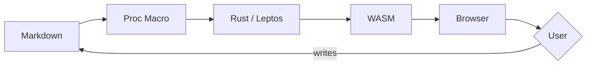

Welcome to the blog. This post is a living reference for every feature the markdown engine supports. If you are writing a post and cannot remember the syntax for something, look here.

## Inline formatting

Regular text, **bold**, _italic_, **_bold italic_**, ~~strikethrough~~, and `inline code`. Links look like [this](/about) and external links like [Rust](https://www.rust-lang.org/).

### Text styles

The basic text styles cover most needs: **bold** for emphasis, _italic_ for titles or foreign words, and `code` for technical terms.

```definition Emphasis {#def:emphasis}
**Emphasis** in writing is the use of typographic variation to draw attention to particular words or phrases.
```

### Links and references

Links can be [internal](/about) or [external](https://www.rust-lang.org/). External links get a small icon to indicate they leave the site.

```remark
Internal links are resolved at build time; broken links will cause a warning.
```

## Mathematics

Inline math: Euler's identity $e^{i\pi} + 1 = 0$ sits in a sentence. The gamma function $\Gamma(n) = (n-1)!$ for positive integers, or more generally:

$$\Gamma(z) = \int_0^{\infty} t^{z-1} e^{-t}\, dt$$

### Display equations

A matrix equation:

$$\begin{pmatrix} a & b \\ c & d \end{pmatrix} \begin{pmatrix} x \\ y \end{pmatrix} = \begin{pmatrix} ax + by \\ cx + dy \end{pmatrix}$$

```definition Matrix multiplication {#def:matrix-mult}
Given matrices $A \in \mathbb{R}^{m \times n}$ and $B \in \mathbb{R}^{n \times p}$, their product $AB \in \mathbb{R}^{m \times p}$ has entries $(AB)_{ij} = \sum_{k=1}^{n} A_{ik} B_{kj}$.
```

### Multi-line math

Multi-line display math with `align`:

\begin{align}
\nabla \cdot \mathbf{E} &= \frac{\rho}{\varepsilon_0} \\
\nabla \cdot \mathbf{B} &= 0 \\
\nabla \times \mathbf{E} &= -\frac{\partial \mathbf{B}}{\partial t} \\
\nabla \times \mathbf{B} &= \mu_0 \mathbf{J} + \mu_0 \varepsilon_0 \frac{\partial \mathbf{E}}{\partial t}
\end{align}

```theorem Maxwell's equations {#thm:maxwell}
The four equations above completely describe classical electromagnetism. Together with the Lorentz force law, they form the foundation of classical electrodynamics.
```

## Labeled blocks

Labeled blocks are the core of the wiki system. Definitions, theorems, lemmas, and proofs are first-class citizens with automatic numbering, cross-referencing, and hover previews.

```definition Metric Space {#def:metric-space}
A **metric space** is a pair $(X, d)$ where $X$ is a set and $d \colon X \times X \to \mathbb{R}$ is a function satisfying for all $x, y, z \in X$:

1. $d(x, y) \geq 0$ with equality iff $x = y$ (positive definiteness)
2. $d(x, y) = d(y, x)$ (symmetry)
3. $d(x, y) \leq d(x, z) + d(z, y)$ (triangle inequality)
```

```example Euclidean metric {#ex:euclidean}
The standard metric on $\mathbb{R}^n$ is

$$d(x, y) = \sqrt{\sum_{i=1}^{n} (x_i - y_i)^2}$$

which makes $(\mathbb{R}^n, d)$ a complete metric space.
```

```theorem Banach fixed-point {#thm:banach}
Let $(X, d)$ be a complete [[def:metric-space]] and $f \colon X \to X$ a contraction, i.e., there exists $0 \leq q < 1$ such that $d(f(x), f(y)) \leq q \cdot d(x, y)$ for all $x, y \in X$. Then $f$ has a unique fixed point $x^* \in X$, and for any $x_0 \in X$ the sequence $x_{n+1} = f(x_n)$ converges to $x^*$.
```

````proof
Let $x_0 \in X$ be arbitrary and define $x_{n+1} = f(x_n)$. By the contraction property,

$$d(x_{n+1}, x_n) \leq q^n \cdot d(x_1, x_0)$$

The sequence $(x_n)$ is Cauchy since for $m > n$:

$$d(x_m, x_n) \leq \frac{q^n}{1 - q} d(x_1, x_0) \to 0$$

Since $X$ is complete, $(x_n)$ converges to some $x^* \in X$. By continuity of $f$ we have $f(x^*) = x^*$. Uniqueness follows from the contraction: if $f(y^*) = y^*$, then $d(x^*, y^*) = d(f(x^*), f(y^*)) \leq q \cdot d(x^*, y^*)$, forcing $d(x^*, y^*) = 0$.
````

```remark
[[thm:banach]] is constructive: it not only proves existence but gives an explicit algorithm. The convergence rate is geometric with ratio $q$, so fewer iterations are needed when $q$ is small. See [@hatcher] for the topological context.
```

## Cross-references

Reference labeled blocks with `[[label]]`. For example, [[def:metric-space]] and [[thm:banach]] above. Cross-post references work too: see [[def:group]] in the group theory article or [[cs/lambda-calculus#def:lambda-term]] from the lambda calculus post.

## Citations

Cite entries from `references.bib` with `[@key]` or `[@key, locator]`:

The standard reference for abstract algebra is [@lang_algebra]. For a more concrete introduction, see [@dummit_foote, Chapter 1]. The categorical perspective is developed in [@category_theory, Chapter IV].

## Footnotes

Footnotes[^1] render at the bottom on mobile and float into the right margin as sidenotes on wide screens[^2].

[^1]: First posed by Pietro Mengoli in 1650, solved by Euler in 1734. The result connects number theory to analysis in a surprising way.

[^2]: Multiple footnotes work independently. Each gets its own margin slot.

## Named equations

```equation Euler's identity {#eq:euler}
e^{i\pi} + 1 = 0
```

Reference it: [[eq:euler]] connects the five most important constants in mathematics.

## Code blocks

Fenced code blocks get syntax highlighting via Prism:

```rust
fn fibonacci(n: u64) -> u64 {
    match n {
        0 => 0,
        1 => 1,
        _ => fibonacci(n - 1) + fibonacci(n - 2),
    }
}
```

```python
def sieve(n: int) -> list[int]:
    is_prime = [True] * (n + 1)
    is_prime[0] = is_prime[1] = False
    for i in range(2, int(n**0.5) + 1):
        if is_prime[i]:
            for j in range(i*i, n + 1, i):
                is_prime[j] = False
    return [i for i, p in enumerate(is_prime) if p]
```

```haskell
fix :: (a -> a) -> a
fix f = let x = f x in x

fibs :: [Integer]
fibs = fix (\fbs -> 0 : 1 : zipWith (+) fbs (tail fbs))
```

## Tables

| Algorithm   | Best          | Average       | Worst         | Space       |
| ----------- | ------------- | ------------- | ------------- | ----------- |
| Bubble Sort | $O(n)$        | $O(n^2)$      | $O(n^2)$      | $O(1)$      |
| Merge Sort  | $O(n \log n)$ | $O(n \log n)$ | $O(n \log n)$ | $O(n)$      |
| Quick Sort  | $O(n \log n)$ | $O(n \log n)$ | $O(n^2)$      | $O(\log n)$ |

## Blockquotes

> The purpose of abstraction is not to be vague, but to create a new semantic level in which one can be absolutely precise.
>
> — Edsger W. Dijkstra

## Lists

Unordered:

- Item one
- Item two
  - Nested item
  - Another nested item
- Item three

Ordered:

1. First
2. Second
3. Third

## TikZ diagrams

A parabola on coordinate axes:

```tikz
\begin{tikzpicture}
  \draw[->] (-2,0) -- (2,0) node[right] {$x$};
  \draw[->] (0,-0.5) -- (0,3) node[above] {$y$};
  \draw[blue, thick, domain=-1.7:1.7, samples=100] plot (\x, {\x*\x});
  \node[blue, right] at (1.4, 2) {$y = x^2$};
  \fill[red] (1,1) circle (2pt) node[right] {$(1\text{,}\; 1)$};
  \fill[red] (-1,1) circle (2pt) node[left] {$(-1\text{,}\; 1)$};
\end{tikzpicture}
```

## Commutative diagrams

A pullback square:

```tikzcd
\begin{tikzcd}
  P \arrow[r, "p_1"] \arrow[d, "p_2"'] \arrow[dr, phantom, "\lrcorner", very near start] & A \arrow[d, "f"] \\
  B \arrow[r, "g"'] & C
\end{tikzcd}
```

## Mermaid diagrams

A build pipeline:



## Callouts

```info
This is an informational callout. Use it for supplementary details.
```

```warning
This is a warning callout. Use it for things to watch out for.
```

```tip
This is a tip callout. Use it for helpful advice.
```

## Internal links

You can link to other posts. For example, the [Lambda Calculus](/blog/cs/lambda-calculus) post covers Church encodings, and [Groups](/blog/math/group-theory) introduces algebraic structures. Those posts will automatically show a "Referenced by" section pointing back here.

## What's not shown inline

A few features are structural rather than per-post:

- **Series navigation** — add `series` and `series_order` to frontmatter to group posts into an ordered series with prev/next links (see the [PLT series](/blog/cs/lambda-calculus))
- **Reading progress bar** — the thin accent-colored bar at the top of this page tracks your scroll position
- **Tag filtering** — click any tag on the [blog listing](/blog) to cycle through include/exclude states
- **Reference backlinks** — each reference at the bottom has markers that scroll you to where the link appears
- **Draft support** — add `draft: true` to frontmatter to exclude a post from the site
- **Pinned blocks** — hover any labeled block to see a pin button; pinned blocks appear in a floating panel for study
- **OG meta tags** — the indexer generates per-post HTML with OpenGraph tags for social embeds
- **RSS/Atom feeds** — available at `/rss.xml` and `/atom.xml`
- **404 page** — navigate to a [nonexistent page](/blog/does-not-exist) to see it
