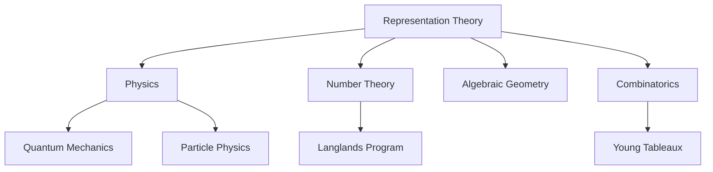

Representation theory studies groups by letting them act on [[def:vector-space|vector spaces]]. This linearizes the problem, making tools from linear algebra available. The classic references are Serre[^serre] and Fulton & Harris[^fh].

[^serre]: Jean-Pierre Serre, *Linear Representations of Finite Groups*, Springer, 1977.
[^fh]: William Fulton & Joe Harris, *Representation Theory: A First Course*, Springer, 1991.

## Representations

```definition Group Representation {#def:representation}
A **representation** of a [[def:group]] $G$ over a [[def:field]] $F$ is a [[def:group-hom|group homomorphism]]

$$\rho: G \to GL(V)$$

where $V$ is a [[def:vector-space]] over $F$ and $GL(V)$ is the group of invertible [[def:linear-map|linear maps]] $V \to V$. The **dimension** of the representation is $\dim V$.
```

```example {#ex:representations}
- The **trivial representation**: $\rho(g) = \text{id}_V$ for all $g$
- The **regular representation**: $G$ acts on $F[G]$ (the group algebra) by left multiplication
- For $G = S_n$: the **permutation representation** on $F^n$ permuting coordinates
- For $G = \mathbb{Z}/n\mathbb{Z}$: the representation $\bar{k} \mapsto e^{2\pi ik/n}$ on $\mathbb{C}$
```

```remark {#rem:rep-action}
A representation is equivalent to a **linear action** of $G$ on $V$: a map $G \times V \to V$ with $(g, v) \mapsto g \cdot v$ that is linear in $v$ and satisfies $g \cdot (h \cdot v) = (gh) \cdot v$ and $e \cdot v = v$.
```

```definition Subrepresentation {#def:subrep}
A [[def:subspace]] $W \subseteq V$ is a **subrepresentation** (or $G$-invariant subspace) if $\rho(g)(W) \subseteq W$ for all $g \in G$.
```

```definition Irreducible Representation {#def:irreducible}
A [[def:representation]] $(V, \rho)$ is **irreducible** (or **simple**) if $V \neq 0$ and the only [[def:subrep|subrepresentations]] are $0$ and $V$.
```

```note
Irreducible representations are the "atoms" of representation theory. They play a role analogous to [[def:prime-ideal|prime ideals]] in ring theory or simple groups in group theory.
```

## Schur's Lemma and Maschke's Theorem

```definition G-linear Map {#def:g-linear}
A [[def:linear-map]] $\varphi: V \to W$ between [[def:representation|representations]] $(\rho_V, V)$ and $(\rho_W, W)$ is **$G$-linear** (or an **intertwining operator**) if

$$\varphi \circ \rho_V(g) = \rho_W(g) \circ \varphi$$

for all $g \in G$.
```

```tikzcd
\begin{tikzcd}
  V \arrow[r, "\varphi"] \arrow[d, "\rho_V(g)"'] & W \arrow[d, "\rho_W(g)"] \\
  V \arrow[r, "\varphi"'] & W
\end{tikzcd}
```

The diagram commutes for every $g \in G$.

```theorem Schur's Lemma {#thm:schur}
Let $\varphi: V \to W$ be a [[def:g-linear]] map between [[def:irreducible]] representations. Then:

1. $\varphi$ is either zero or an isomorphism
2. If $V = W$ and $F$ is algebraically closed, then $\varphi = \lambda \cdot \text{id}$ for some $\lambda \in F$
```

```proof {#proof:schur}
For (1): $\ker(\varphi)$ is a [[def:subrep]] of $V$ (if $v \in \ker(\varphi)$, then $\varphi(\rho_V(g)v) = \rho_W(g)\varphi(v) = 0$). Since $V$ is irreducible, $\ker(\varphi) = 0$ or $V$. Similarly $\text{im}(\varphi)$ is a subrepresentation of $W$. If $\varphi \neq 0$, then $\ker(\varphi) = 0$ (injective) and $\text{im}(\varphi) = W$ (surjective).

For (2): Over an algebraically closed field, $\varphi$ has an eigenvalue $\lambda$. Then $\varphi - \lambda \cdot \text{id}$ is $G$-linear with nontrivial kernel, so by (1) it must be zero.
```

```theorem Maschke's Theorem {#thm:maschke}
Let $G$ be a finite [[def:group]] and $F$ a [[def:field]] with $\text{char}(F) \nmid |G|$. Then every finite-dimensional [[def:representation]] of $G$ is **completely reducible**: it decomposes as a direct sum of [[def:irreducible]] representations.
```

```proof {#proof:maschke}
It suffices to show that every [[def:subrep]] $W \subseteq V$ has a $G$-invariant complement. Let $\pi_0: V \to W$ be any linear projection. Define the **averaged projection**:

$$\pi = \frac{1}{|G|} \sum_{g \in G} \rho(g) \circ \pi_0 \circ \rho(g)^{-1}$$

Then $\pi$ is $G$-linear and $\pi|_W = \text{id}_W$ (since $W$ is $G$-invariant). The kernel $\ker(\pi)$ is a $G$-invariant complement of $W$. The factor $\frac{1}{|G|}$ requires $\text{char}(F) \nmid |G|$.
```

```warning
Maschke's theorem fails when $\text{char}(F)$ divides $|G|$ — this is the realm of **modular representation theory**, which is considerably harder. For example, the regular representation of $\mathbb{Z}/p\mathbb{Z}$ over $\mathbb{F}_p$ is indecomposable but not irreducible.
```

## Characters

```definition Character {#def:character}
The **character** of a [[def:representation]] $\rho: G \to GL(V)$ is the function $\chi_\rho: G \to F$ defined by

$$\chi_\rho(g) = \text{tr}(\rho(g))$$

Characters are class functions: $\chi(ghg^{-1}) = \chi(h)$ for all $g, h \in G$.
```

Characters encode essential information about representations:

| Property | Character value |
|---|---|
| Dimension | $\chi(e) = \dim V$ |
| Trivial rep | $\chi(g) = 1$ for all $g$ |
| Direct sum | $\chi_{V \oplus W} = \chi_V + \chi_W$ |
| Tensor product | $\chi_{V \otimes W}(g) = \chi_V(g) \cdot \chi_W(g)$ |
| Dual rep | $\chi_{V^*}(g) = \overline{\chi_V(g)}$ |

```theorem Orthogonality Relations {#thm:orthogonality}
Let $\chi_i, \chi_j$ be characters of [[def:irreducible]] representations of a finite [[def:group]] $G$ over $\mathbb{C}$. Then:

$$\frac{1}{|G|} \sum_{g \in G} \chi_i(g) \overline{\chi_j(g)} = \delta_{ij}$$
```

```corollary {#cor:character-determines}
Two representations of a finite group over $\mathbb{C}$ are isomorphic if and only if they have the same character.
```

## Example: Character Table of $S_3$

The [[def:symmetric-group|symmetric group]] $S_3$ has three conjugacy classes: $\{e\}$, $\{(12), (13), (23)\}$, $\{(123), (132)\}$. It has exactly three irreducible representations[^1]:

[^1]: A finite group has exactly as many irreducible representations (over $\mathbb{C}$) as conjugacy classes. Their dimensions satisfy $\sum d_i^2 = |G|$.

| | $\{e\}$ | $\{(12),(13),(23)\}$ | $\{(123),(132)\}$ |
|---|---|---|---|
| Trivial $\chi_1$ | $1$ | $1$ | $1$ |
| Sign $\chi_2$ | $1$ | $-1$ | $1$ |
| Standard $\chi_3$ | $2$ | $0$ | $-1$ |

Check: $1^2 + 1^2 + 2^2 = 6 = |S_3|$ and the rows are orthogonal under the inner product $\langle \chi_i, \chi_j \rangle = \frac{1}{6}\sum_{g} \chi_i(g)\overline{\chi_j(g)}$.

> The character table is a complete invariant for finite groups over $\mathbb{C}$ — it determines the group up to isomorphism (for many groups, though not all).

## Applications

Representation theory connects to many areas:



```info
In quantum mechanics, the irreducible representations of symmetry groups classify the possible states of a physical system. The representation theory of $SU(2)$ gives the theory of angular momentum (spin $0$, $\frac{1}{2}$, $1$, $\frac{3}{2}$, ...), and the representations of the Poincaré group classify elementary particles[^serre].
```
