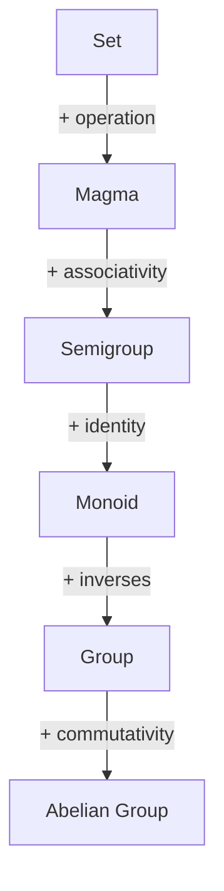

The foundational treatment follows Lang [@lang_algebra] and Dummit & Foote [@dummit_foote]. We also draw on Aluffi [@aluffi] for the categorical perspective.

## Groups

```axiom Group Axioms {#ax:group-axioms}
A group is a set equipped with a single binary operation satisfying three axioms: associativity, identity, and inverses. These axioms are independent — none can be derived from the others.
```

```definition Group {#def:group}
A **group** $(G, \cdot)$ is a set $G$ together with a binary operation $\cdot : G \times G \to G$ satisfying:

1. **Associativity**: $(a \cdot b) \cdot c = a \cdot (b \cdot c)$ for all $a, b, c \in G$
2. **Identity**: there exists $e \in G$ such that $e \cdot a = a \cdot e = a$ for all $a \in G$
3. **Inverse**: for each $a \in G$, there exists $a^{-1} \in G$ with $a \cdot a^{-1} = a^{-1} \cdot a = e$
```

```definition Abelian Group {#def:abelian-group}
A group $(G, \cdot)$ is **abelian** (or **commutative**) if $a \cdot b = b \cdot a$ for all $a, b \in G$.
```

```example {#ex:groups}
- $(\mathbb{Z}, +)$: integers under addition
- $(\mathbb{Z}/n\mathbb{Z}, +)$: integers modulo $n$
- $(S_n, \circ)$: symmetric group on $n$ elements
- $(GL_n(\mathbb{R}), \cdot)$: invertible $n \times n$ matrices
```

The relationship between these structures:



```remark {#rem:group-order}
The **order** of a group $G$, written $|G|$, is the cardinality of its underlying set. The **order** of an element $g \in G$ is the smallest positive integer $n$ with $g^n = e$, or $\infty$ if no such $n$ exists.
```

```definition Subgroup {#def:subgroup}
A subset $H \subseteq G$ is a **subgroup** of $G$ (written $H \leq G$) if $H$ is itself a group under the restriction of the group operation.
```

```lemma Subgroup Criterion {#lem:subgroup-criterion}
A nonempty subset $H \subseteq G$ is a subgroup if and only if for all $a, b \in H$, we have $a \cdot b^{-1} \in H$.
```

```proof {#proof:subgroup-criterion}
($\Rightarrow$) If $H$ is a subgroup, then $b^{-1} \in H$ for all $b \in H$, and $H$ is closed under the operation, so $ab^{-1} \in H$.

($\Leftarrow$) Let $a \in H$ (nonempty). Then $e = aa^{-1} \in H$. For any $b \in H$, $b^{-1} = eb^{-1} \in H$. For $a, b \in H$, $ab = a(b^{-1})^{-1} \in H$. Associativity is inherited from $G$.
```

> Every group $G$ has at least two subgroups: the **trivial subgroup** $\{e\}$ and $G$ itself.

## Homomorphisms

```definition Group Homomorphism {#def:group-hom}
A **group homomorphism** $\varphi: G \to H$ is a map that preserves the group structure:

$$\varphi(a \cdot_G b) = \varphi(a) \cdot_H \varphi(b)$$

for all $a, b \in G$.
```

```definition Kernel and Image {#def:kernel-image}
For a homomorphism $\varphi: G \to H$:
- The **kernel** is $\ker(\varphi) = \{ g \in G : \varphi(g) = e_H \}$
- The **image** is $\text{im}(\varphi) = \{ \varphi(g) : g \in G \}$
```

| Property         | Condition                |
| ---------------- | ------------------------ |
| Injective (mono) | $\ker(\varphi) = \{e\}$  |
| Surjective (epi) | $\text{im}(\varphi) = H$ |
| Bijective (iso)  | Both                     |

```definition Normal Subgroup {#def:normal-subgroup}
A [[def:subgroup]] $N \leq G$ is **normal** (written $N \trianglelefteq G$) if $gNg^{-1} = N$ for all $g \in G$.
```

```proposition {#prop:kernel-normal}
For any [[def:group-hom]] $\varphi: G \to H$, the kernel $\ker(\varphi)$ is a [[def:normal-subgroup]] of $G$.
```

```proof {#proof:kernel-normal}
Let $n \in \ker(\varphi)$ and $g \in G$. Then $\varphi(gng^{-1}) = \varphi(g)\varphi(n)\varphi(g)^{-1} = \varphi(g) e_H \varphi(g)^{-1} = e_H$. So $gng^{-1} \in \ker(\varphi)$.
```

## The Isomorphism Theorems

```theorem First Isomorphism Theorem {#thm:group-iso-1}
If $\varphi: G \to H$ is a [[def:group-hom]], then $\ker(\varphi) \trianglelefteq G$ and

$$G / \ker(\varphi) \cong \text{im}(\varphi)$$
```

```equation First Isomorphism {#eq:first-iso}
G / \ker(\varphi) \cong \text{im}(\varphi)
```

```proof {#proof:group-iso-1}
Consider the map $\bar{\varphi}: G/\ker(\varphi) \to \text{im}(\varphi)$ defined by $\bar{\varphi}(g\ker(\varphi)) = \varphi(g)$. This is well-defined: if $g\ker(\varphi) = g'\ker(\varphi)$, then $g^{-1}g' \in \ker(\varphi)$, so $\varphi(g) = \varphi(g')$. It is a homomorphism since $\varphi$ is, and it is bijective by construction.
```

The universal property of the quotient group:

```tikzcd
\begin{tikzcd}
  G \arrow[r, "\varphi"] \arrow[d, "\pi"'] & H \\
  G/\ker(\varphi) \arrow[ur, "\bar{\varphi}"', dashed] &
\end{tikzcd}
```

Here $\pi$ is the canonical projection and $\bar{\varphi}$ is the induced isomorphism [[eq:first-iso]] from [[thm:group-iso-1]].

```note
The first isomorphism theorem has analogues in every algebraic category: [[thm:ring-iso-1|rings]], modules, and vector spaces ([[thm:rank-nullity]]). In category theory, this reflects the fact that every morphism factors as an epi followed by a mono.
```

## Cosets and Lagrange's Theorem

```definition Coset {#def:coset}
For a [[def:subgroup]] $H \leq G$ and element $g \in G$, the **left coset** of $H$ by $g$ is $gH = \{gh : h \in H\}$.
```

```theorem Lagrange's Theorem {#thm:lagrange}
If $G$ is a finite [[def:group]] and $H \leq G$, then $|H|$ divides $|G|$. In particular, $|G| = [G:H] \cdot |H|$, where $[G:H]$ is the number of distinct [[def:coset|cosets]].
```

```proof {#proof:lagrange}
The left cosets of $H$ partition $G$: each element $g \in G$ belongs to exactly one coset $gH$. Every coset has $|H|$ elements (the map $h \mapsto gh$ is a bijection $H \to gH$). Since $G$ is the disjoint union of $[G:H]$ cosets each of size $|H|$, we have $|G| = [G:H] \cdot |H|$.
```

```corollary {#cor:order-divides}
The order of every element in a finite [[def:group]] divides the order of the group.
```

```proof {#proof:order-divides}
The order of $g$ equals $|\langle g \rangle|$, the order of the cyclic subgroup generated by $g$. By [[thm:lagrange]], $|\langle g \rangle|$ divides $|G|$.
```

## The Symmetric Group[^1]

[^1]: The symmetric group $S_n$ plays a central role in algebra. Cayley's theorem states that every finite group embeds into some $S_n$, making symmetric groups "universal" among finite groups.

```definition Symmetric Group {#def:symmetric-group}
The **symmetric group** $S_n$ is the [[def:group]] of all permutations of $\{1, 2, \ldots, n\}$, with composition as the group operation. It has order $|S_n| = n!$.
```

Every permutation can be written as a product of disjoint cycles. For example, in $S_5$:

$$(1\;3\;5)(2\;4) \in S_5$$

sends $1 \mapsto 3 \mapsto 5 \mapsto 1$ and $2 \mapsto 4 \mapsto 2$.

```definition Alternating Group {#def:alternating-group}
The **alternating group** $A_n$ is the [[def:subgroup]] of $S_n$ consisting of even permutations. It is a [[def:normal-subgroup]] of $S_n$ with $[S_n : A_n] = 2$.
```

```tip
For $n \geq 5$, $A_n$ is a **simple group** — it has no nontrivial normal subgroups. This is a key ingredient in the proof that the general quintic cannot be solved by radicals.
```
